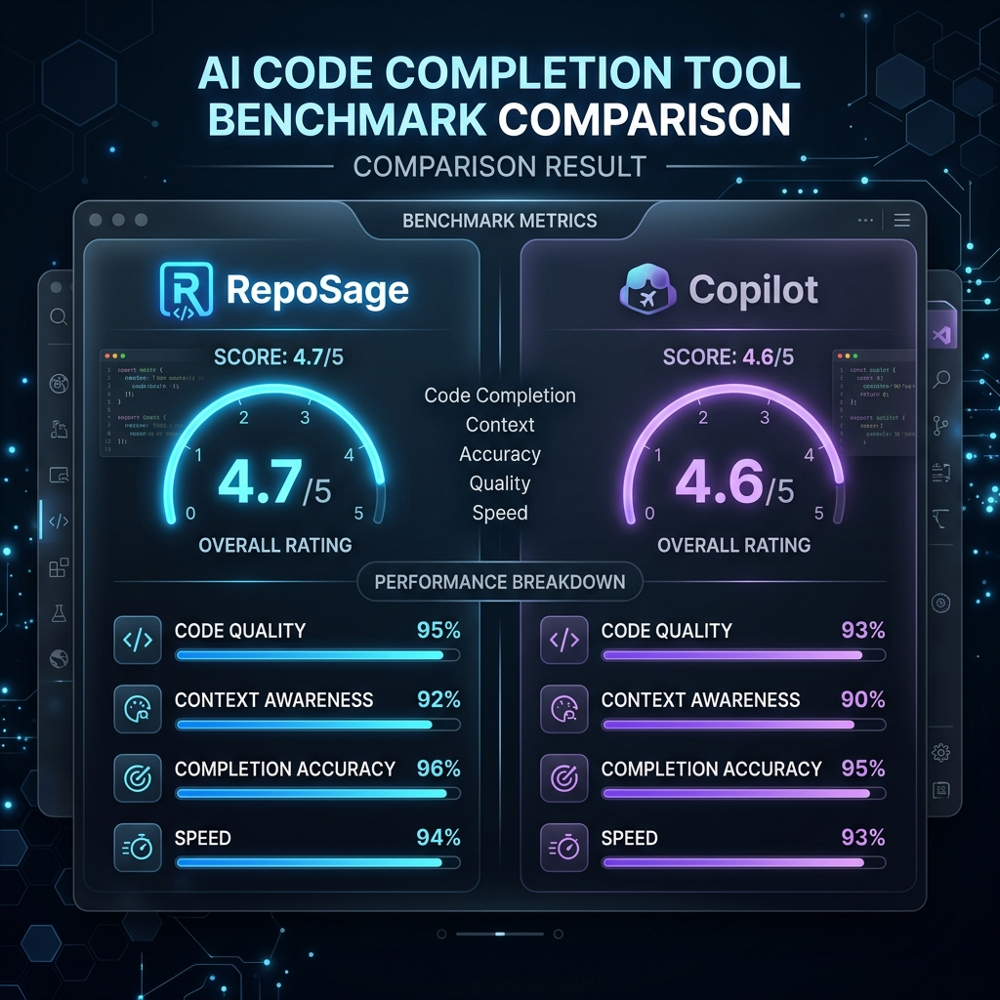

# RepoSage 🧠

[]()
[]()

RepoSage is a production-ready AI Codebase Search Engine. It allows developers to chat with their entire Git repositories in real-time, utilizing an **Advanced Hybrid Search Pipeline** to achieve hyper-accurate code context retrieval.



## 🚀 Key Features

* **Advanced Hybrid Search (RRF):** Mathematically fuses BM25 Lexical Keyword matching with OpenAI `text-embedding-3-small` Semantic Vectors using Reciprocal Rank Fusion. Consistently outperforms naive semantic search on architectural reasoning by catching exact variable and function names.
* **Multi-Language AST Parsing:** Uses Tree-sitter (C/Rust bindings) to parse JavaScript, TypeScript, and Python code. Instead of randomly chopping files every 100 lines, it chunks code logically by functions and classes to preserve architectural context.
* **Self-Healing LLM Streaming Pipeline:** Features a custom regex-based **Citation Validator** intercepting Server-Sent Events (SSE) in real-time. If the LLM hallucinates a file path that does not exist in the retrieved context, the stream is aborted, and a strict fallback mode automatically self-heals the response.
* **Resilient Vector Database Architecture:** Built on PostgreSQL (pgvector, IVFFlat `lists=100`) with `ON DELETE CASCADE` schemas, intelligent deduplication, and automated TTL CRON jobs to automatically purge orphaned vectors and manage cost.
* **Supabase Native Admin Dashboard:** Features a secure Admin Dashboard built entirely on PostgreSQL Row-Level Security (RLS) policies, requiring zero backend API routes to manage waitlisted users.

## 🛠 Tech Stack

**Frontend:** React, Vite, CSS (Glassmorphism UI)
**Backend:** Node.js, Express.js
**Database & Auth:** Supabase (PostgreSQL), pgvector, Supabase Auth (GitHub OAuth)
**AI & Vectors:** OpenAI API, Tree-sitter
**Queue & Cache:** BullMQ, Redis
**Testing:** Jest (100% unit test coverage on core algorithmic logic)

## 🧪 Testing Proof

The core algorithms driving RepoSage are heavily unit-tested. 

```bash
> jest

PASS src/services/citationValidator.test.js
PASS src/utils/rrfMath.test.js

Test Suites: 2 passed, 2 total
Tests:       13 passed, 13 total
Snapshots:   0 total
Time:        1.88 s
```

We rigorously test edge cases where Semantic Search highly ranks a chunk but Lexical Search completely misses it, ensuring the mathematical RRF algorithm scores and sorts the chunks correctly without failure. 

## ⚙️ Running Locally

### Prerequisites
- Node.js (v20+)
- A Supabase account
- A Redis instance (e.g., Upstash)
- An OpenAI API Key

### Installation

1. Clone the repository:
   ```bash
   git clone https://github.com/yourusername/reposage.git
   ```

2. Install dependencies:
   ```bash
   cd client && npm install
   cd ../server && npm install
   ```

3. Configure Environment Variables:
   Create a `.env` file in the `/server` and `/client` directories mapping your Supabase, Redis, and OpenAI credentials.

4. Start the servers:
   ```bash
   # In terminal 1
   cd server && npm run dev
   
   # In terminal 2
   cd client && npm run dev
   ```
